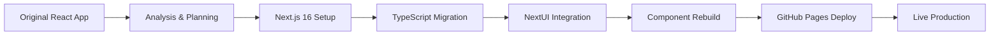

# 🧀 CheeseMath

[](https://nextjs.org/)
[](https://www.typescriptlang.org/)
[](https://bun.sh/)
[](https://nextui.org/)
[](https://tailwindcss.com/)
[](https://opensource.org/licenses/MIT)

> **Advanced Calculator Suite** — Modern mathematics, string manipulation, regex analysis, and credit card validation tools, rebuilt with Next.js 16, TypeScript, and NextUI.

🔗 **[View Live Demo](https://bradleymatera.github.io/CheeseMath-Jest-Tests/)**

---

## 📂 Repository Structure

This repository contains **two versions** of the CheeseMath calculator:

### 1️⃣ **Original React App** (`/CheeseMath`)
- **Stack**: React 18, AnimeJS, Jest, Selenium
- **Purpose**: Legacy version with original implementation
- **Status**: Preserved for reference

### 2️⃣ **Next.js 16 Rebuild** (`/cheese-math-nextjs`) ⭐
- **Stack**: Next.js 16 App Router, TypeScript, Bun, NextUI, Tailwind CSS, Framer Motion
- **Purpose**: Modern production version with enhanced features
- **Status**: Active development, deployed to GitHub Pages
- **Documentation**: See [cheese-math-nextjs/README.md](cheese-math-nextjs/README.md)

---

## 🚀 Quick Start (Next.js Version)

```bash
# Navigate to Next.js project
cd cheese-math-nextjs

# Install dependencies with Bun
bun install

# Run development server
bun run dev

# Build for production
bun run build

# Build for GitHub Pages
bun run build:pages
```

Development server: **http://localhost:3000**  
Production site: **https://bradleymatera.github.io/CheeseMath-Jest-Tests/**

---

## ✨ Features

### 🔢 Basic Calculator
- **Operations**: Add, Subtract, Multiply, Divide, Square Root, Max, Min
- **Enhanced**: Power and Modulo functions
- **UI**: NextUI cards with smooth animations

### 🧩 Advanced Calculator
- **String Ops**: Reverse, Palindrome check, Capitalize words
- **Analysis**: Vowel counter, Consonant counter
- **Array Ops**: Sum of array elements
- **UI**: Tab-based interface with visual feedback

### 🔍 Regex Analyzer
- **Pattern Matching**: Dynamic regex with custom patterns
- **Validation**: Email, Phone, URL validators
- **Extraction**: Extract numbers and emails from text
- **UI**: Three-tab interface (Match, Validate, Extract)

### 💳 Credit Card Tools
- **Obscuring**: Secure masking (XXXX-XXXX-XXXX-1234)
- **Validation**: Luhn algorithm implementation
- **Detection**: Auto-detect card type (Visa, MC, Amex, Discover)
- **Formatting**: Auto-format with dashes
- **UI**: Test card buttons for quick testing

---

## 🎨 Tech Stack Comparison

| Feature | Original React | Next.js 16 Rebuild |
|---------|---------------|-------------------|
| **Framework** | React 18 | Next.js 16 App Router |
| **Language** | JavaScript | TypeScript 5.9.3 |
| **Runtime** | Node.js | Bun 1.3.1 |
| **UI Library** | Custom CSS | NextUI 2.6.11 |
| **Styling** | Vanilla CSS | Tailwind CSS 3.4.18 |
| **Animations** | AnimeJS | Framer Motion 12 |
| **Theme** | ❌ Static | ✅ Dark/Light Mode |
| **Testing** | Jest, Selenium | Planned (Vitest, Playwright) |
| **Deployment** | Vercel | GitHub Pages |
| **Performance** | Good | Excellent (Static Export) |

---

## 📊 Project Evolution



---

## 🛠️ Development

### Working with Original React App
```bash
cd CheeseMath
npm install
npm start
npm test
```

### Working with Next.js App
```bash
cd cheese-math-nextjs
bun install
bun run dev
bun test  # (coming soon)
```

---

## 📦 Deployment

### Next.js Version (GitHub Pages)
The Next.js version is automatically deployed via GitHub Actions:

1. **Push to main** → GitHub Actions triggers
2. **Build process** → `bun run build:pages`
3. **Static export** → Generated in `/docs` folder
4. **Deploy** → Committed and pushed automatically
5. **Live site** → Updated at GitHub Pages URL

**Manual deployment:**
```bash
bun run build:pages
git add .
git commit -m "Deploy to GitHub Pages"
git push
```

### Original Version (Vercel)
```bash
cd CheeseMath
vercel --prod
```

---

## 🧪 Testing

### Original React App
- ✅ Jest unit tests in `/CheeseMath/tests/`
- ✅ Selenium E2E tests
- ✅ Coverage reports

### Next.js App
- 🚧 Vitest unit tests (planned)
- 🚧 Playwright E2E tests (planned)
- 🚧 Component tests (planned)

---

## 📖 Documentation

- **[Next.js App README](cheese-math-nextjs/README.md)** - Full documentation for modern version
- **[Next.js App TODO](cheese-math-nextjs/TODO.md)** - Future enhancements and roadmap
- **[Original App README](CheeseMath/README.md)** - Legacy version documentation

---

## 🤝 Contributing

Contributions welcome! Please:

1. Fork the repository
2. Create a feature branch (`git checkout -b feature/amazing-feature`)
3. Commit your changes (`git commit -m 'Add amazing feature'`)
4. Push to the branch (`git push origin feature/amazing-feature`)
5. Open a Pull Request

---

## 📄 License

MIT License - see LICENSE file for details

---

## 👤 Author

**Bradley Matera**

[](https://github.com/BradleyMatera)
[](https://bradleymatera.dev)

---

<p align="center">
  
</p>

<p align="center">
  <strong>Built with 🧀 and ❤️</strong>
</p>
